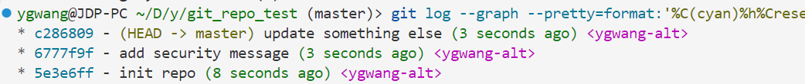
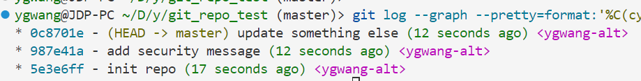
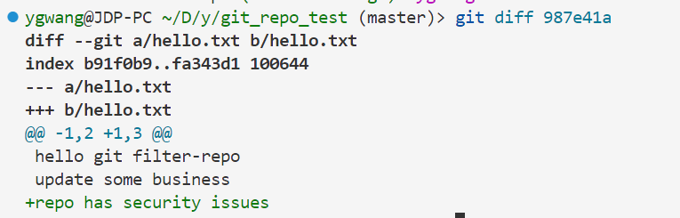

在日常的项目开发过程中，多人协作有时候难免会有开发同学因误操作，将一些敏感信息（如密钥、数据库密码登）提交到Git仓库的中。这样如果还未推送到远端，一般还可以 `git reset --soft` 掉重新提交。但是一旦提交到了Git远端仓库，单靠删除或者修改这些文件的信息，已经很难将这些敏感信息彻底擦出。因为Git作为版本控制工具，会在历史纪录中保留所有的内容，不仅影响项目的安全性，还有可能会对客户的产品和终端用户产生影响。


本文将从一个实际案例出发，介绍如何使用Git工具`git filter-repo`来清理Git仓库中的敏感信息，并探讨其中的原理及其他适用场景。

<!--more-->

# 背景

最近在项目中，就遇到了开发同学误将数据库的密码提交到了Git远程仓库中，且发现的时候在那个提交之后有了更多的提交纪录。导致敏感信息被纪录到历史的情况。由于代码库在组织内是公开的，这就导致项目的敏感信息会被暴露给了更多的人，从而可能产生一些安全问题。

为了确保敏感数据不被更多的人获取到，我们需要有效的从Git的历史纪录中清除这些信息，而不是简单的删除掉文件，再重新提交。

那么如何能在不丢失历史纪录的前提下，从Git仓库删除掉这些敏感信息呢？:see_no_evil:

# 解决方案
经过调研，我们发现有两款工具可以用来解决我们上述说到的问题。**git filter-branch**和**git filter-repo**，Git官方的建议是filter-branch存在较多的安全缺陷[^1]，且无法向后兼容的进行修复，因此已经不建议使用了。推荐使用git filter-repo，经过调研后发现其更加高效且功能强大，是清理敏感信息、移除文件、重构 Git 历史记录的首选工具。

## 现场还原
为了更好的说明这个问题，我们下面会初始化一个git仓库，并且还原提交了敏感信息到仓库的状态

**初始化项目目录**
```sh
mkdir git_repo_test;
cd git_repo_test;
git init .;
echo "hello git filter-repo" >> hello.txt
git add .;
git commit -m"init repo";
```

**模拟提交敏感信息**
```sh
echo "password=UEJn1k1@3k" >> .env;
echo "update some business" >> hello.txt;
git add .;
git commit -m"add security message";
echo "repo has security issues" >> hello.txt;
git add .;
git commit -m"update something else";
```

**通过Git log查看历史纪录**
```sh
git log --graph --pretty=format:'%C(cyan)%h%Creset -%C(yellow)%d%Creset %s %Cgreen(%cr) %C(magenta)<%an>%Creset' --abbrev-commit --date=relative
```



## 进行修复
Git filter-repo是采用Python开发的一个工具，因此在安装前需要确认下本机是否有Python3的环境。具体的安装方法可以参考[Github](https://github.com/newren/git-filter-repo/blob/main/INSTALL.md)的介绍。

### 工具安装
```sh
# 包管理软件安装
apt install git-filter-repo # for linxu
brew install git-filter-repo # for macos

# 也可以使用python的pip工具进行安装
pip install git-filter-repo
```

### 敏感信息移除
在上述模拟的历史仓库中，第二条提交中误将`.env`文件提交到了历史中，并且还包含了针对其他文件的修改，我们下面借助`git filter-repo`来进行清除所有包含`.env`这个文件的提交
```sh
git filter-repo --path .env --invert-paths --force
```

**执行结果**
```
Parsed 3 commits
New history written in 0.35 seconds; now repacking/cleaning...
Repacking your repo and cleaning out old unneeded objects
HEAD is now at e8aeffb update something else
Enumerating objects: 9, done.
Counting objects: 100% (9/9), done.
Delta compression using up to 12 threads
Compressing objects: 100% (4/4), done.
Writing objects: 100% (9/9), done.
Total 9 (delta 0), reused 0 (delta 0), pack-reused 0
Completely finished after 0.40 seconds.
```

**历史记录**



在清理后，我们查看历史纪录，可以发现。第二个提交的commit ID已经发生了变化，并且影响了后续的提交commit ID。这是因为Git的commit ID在计算的时候会参考提交内容、父提交的hash值，提交元信息等因素。`git filter-repo`工具在检查第二个提交的时候，发现存在敏感信息，因此重新修改了第二个提交的内容并重新生产了新的提交，因此导致后续所有的提交的commit ID都发生了变化，这是Git的原理所决定的。

**确认清理效果**



**推送远端仓库**

清理后因为仓库的变化和远端已经匹配不上了，因此需要使用`force`来强制推送
```sh
git push origin master --force
```

# 原理探究

# 适用场景

1. 修改作者信息

2. 修改密钥信息

3. 删除特定文件

# 我的思考


[^1]: https://git-scm.com/docs/git-filter-branch#_warning